# Godot Graph Visualizer 

Hey thereee! Im Sam, this is my plugin: Godot Graph Visualizer.

In this README im going to breafly explain the reason and purpose of this plugin, hope you love it!!!

## Main purpose

Godot Graph Visualizer is a permissive open source plugin made for Godot Engine. Its main purpose is helping Godot developers to understand the structure of their project. With the help of built-in nodes of the editor, it displays relations between scenes inside your project!

The idea is mainly driven (but not exclusive) to beginners, helping them by giving a little guide of how certain things are related when their projects starts to get bigger and bigger.

## Functionality

The main functionality of this plugin is displaying a graph with all your project scenes.

Each scene (node) will be related to other scenes.

> Whats a relation between two scenes?

Simple, when you create an _instance_ to a scene, youre creating a _reference_ to it. But... This doesnt end right here, most of the time you can see instances on the scene tree the editor has built-in.

What makes this apporach special, is the fact that it doesnt only makes "_explicit_" references _(references that can be seen within the scene tree)_ visible, it also makes more "_implicit_" references visible.

> Yeah but... What are "_implicit_" references?

Implicit references are when you create a reference to another scene inside a `.gd` file. For example:

**Using preloads:**

```gdscript
var a := preload("res://path_to_scene.tscn")
```

**Using loads:**

```gdscript
var b := load("res://path_to_scene.tscn")
```

**Using packedscene instances:**

```gdscript
var c := preload("res://path_to_scene.tscn").instantiate()
```

**Or even using ResourceLoader:**

```gdscript
var d := ResourceLoader.load("res://path_to_scene.tscn", "PackedScene")
```

### Example

#### Example with packedscenes

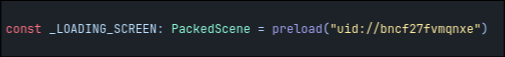
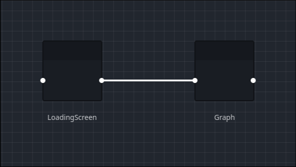

_LoadingScreen_ is the reference made by _Graph_

#### Example with scene instances

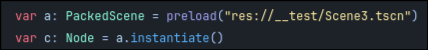
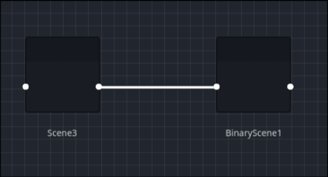

_Scene3_ is the reference made by _BinaryScene1_

Another really important functionality is the capacity of using a... _forgotten_ feature of the editor: the "Editor Description"

The Editor Description is a property every node has in the editor, what is does is to display a message when you hover a scene insde the scene tree.

I decided to take this idea a bit further. How? Making you being able to use this property as a source of _scene documentation_.

Whatever you write within the Editor Description property, will be displayed as an aside section of each node.

### Example

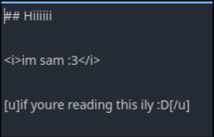


The scene documenter supports 3 syntaxes:

- BBcode (natively)
- Markdown
- HTML

It is encouraged the main use BBcode syntax, but you are not limited to do so and can opt to choose between the 3, even mixing them all along the documentation.

## Okay but... why?

Lets imagine something: You leave your project for some time, it can be for vacations, just  taking a break, etc. When you return you probably will take a while to get on where you left it, because you may have forgotten something important, you didnt document something properly, and so on.

With this plugin, im not ensuring you that you WILL understand everything about your project immediately. This plugin exists for _helping_ you to understand _how_ things are related.

For example:

> Oh, i see that the Player scene makes a packedscene reference to the Weapon scene, i now understand that these two are related, with this knowledge i can now understand _why_ they are related more easily.

This of course, also encourages the developer to name their scenes accordingly of what their general purpose can be.

## How to use this plugin in your project?

Download or clone this repository, and then simply copy and paste [this directory](addons) inside your project.

After this, go to project settings ->

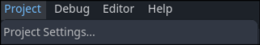

Here, you go to the "Plugin" tab and activate the Godot Graph Visualizer plugin ->

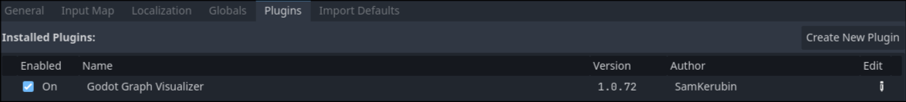

And youre good to go!

## How to use plugin functionalities?

Most functionalities can be managed using the plugins UI:

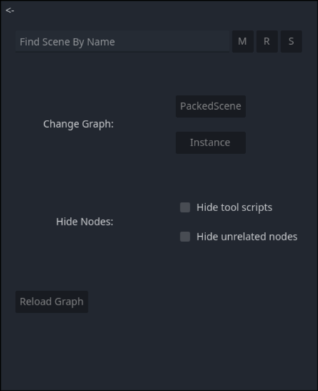

Let me divide really quick what each part does:

**Search bar:**

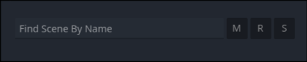
> _NOTE: This feature is still not working on versions 1.0.8 or below_

You can search a scene using its name, it will display only the node with the name you entered and every _direct_ child of that node.

**Change graph type:**

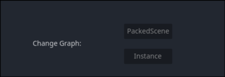

For making things a bit simpler to understand, graph types are divided in _PackedScene_ (`preload`/`load`) and _Instance_ (`scn.instantiate()` or direct instances)


**Hide nodes:**

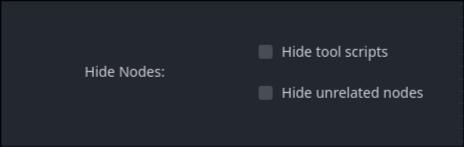

You can also pick which nodes you want to see, matching:

- If they are used as [tool scripts](https://docs.godotengine.org/en/stable/tutorials/plugins/running_code_in_the_editor.html)
- If the node has children (outgoing relations)

**Reload the graph:**

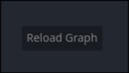

Unfortunately, reloading the graph automatically uses a looot of resources. For fixing this issue, a button for reloading the graph is made.

Every time you want to see the changes you made in the graph, you can either restart the plugin or use the "Reload Graph" button.

## Side notes

- This plugin is still not 100% usable for the public, it is still in an early development stage. However, this doesnt mean  you cannot use it, feel free to try it out!

- As this is still in early stages, please expect many things to not function properly, and also expect many things to change!

- All feedback is accepted and encouraged :3

## Thats all for now!!!

Well, what can i say? Thanks for reading this, and i really hope you enjoy using this plugin! :D

Im honestly really proud of what ive been doing these last months with this silly project that started as something to help myself, and now is something im wanting to do for everyone else out there that also struggles with their project structures!

Please, if you try this plugin and find any issue or have any suggestion, dont be afraid of telling me! Ill be more than glad to respond as quickly as i can and start working on tha whenever i can!!

Thank you <3

Hope we meet again on the road ahead :3