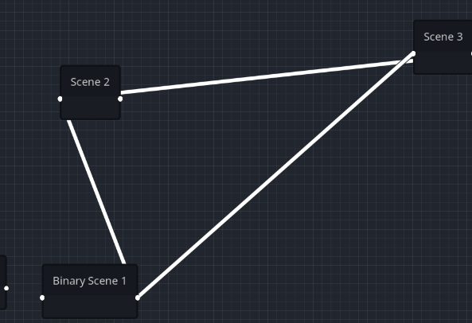

# Godot Graph Visualizer 

Hello! Thanks for being interested on this plugin <3

This plugin was made for those who get lost easily in their own structure. Yes, im aware thats an individual developer fault but hey, im still a developer and im here to make life easier to other devs :3

## Main Problematic

Lets imagine a quick situation:

Lets say that you are making a game using Godot Engine, and then you suddenly left hanging your project for 2-3 months.

What do you think will happen?

Some of you might say:

_Well, i can remember most things, but i still need to review critical points of my code to understand what i was doing_

BUT... Some others (people like me) might say:

_I dont even remember what i was trying to do with this, should i restart everything?_

If thats you, then let me introduce you to my personal solution to this issue.

## Solution to this issue

I hope we all agree that visualizing something makes things 100 times easier to understand

And... Whats better than having a _graph_ to visualize YOUR project and its dependencies and relations?

What do i mean by this? Simple :3

Look at this img for example

Here you can clearly say that those 3 scenes have a relation between them (that image might be wrong and ill replace it later)

But... _Why?_ Godot already lets you visualize the _dependencies_ in a scene tree, why are you making this?

Well, lets make it simple: Besides of just displaying the dependencies of the scene tree, it also checks for run time dependencies and relations.

What am i talking about?

Godot uses different methods to create instances of a scene/script, such as:

- load("path")
- preload("path")
- scene.instantiate()
- ResourceLoader.load("path")

What this plugin does, is making those run time relations explicit before executing the project. Basically, think of it as a way of reviewing how your scenes will interact with each other

## How to use it?

Here you can see the _only_ functionalities this plugin have by now (yeah, its quite alot i know)

You can either see an instance-based graph or a packedcene-based. What does this means?

This basically means the type of relation a scene have with another.

For making it simpler:

- PackedScene realations: load() | preload() | ResourceLoader.load()
- Instance relations: scene.instantiate()

You can also use the checkboxes to hide/show tool scenes/scripts and unrelated scenes. What do i mean by "tool scenes/scripts"?

You can check it out on Godot Docs, check for [@tool annotations](https://docs.godotengine.org/en/stable/tutorials/plugins/running_code_in_the_editor.html)

And last, use the "Reload Graph" button to... That, to reload the graph :3

For now, you can move the nodes in the graph at will

## Changes

Pelase consider that this plugin is still under development and might be on a reaaally early stage so please, expect many changes on upcoming versions.

Ill try to launch a version every 3-4 months (i aint promising that)

## Thanks <3

For now, this is all i can say :3

Im really thankful youre interested on this plugin and hope you enjoy using it.

Ill be more than thankful to get a feedback if you are willing to use the plugin. If thats the case, please contact me via:

- Email: samuelkiller2013@gmail.com
- [Instagram](https://instagram.com/SamKerubin)

Byeee, hope we meet again soon <3

ILY <33